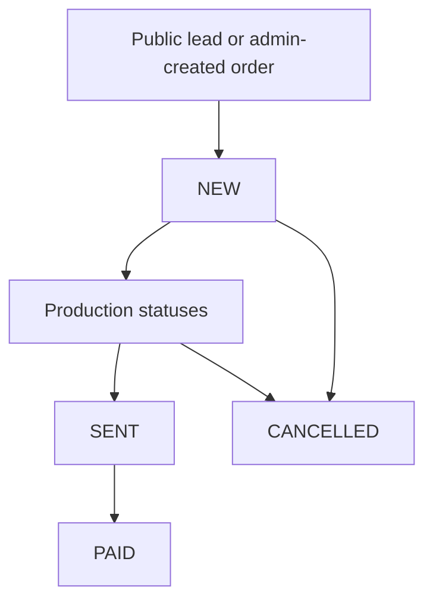

# System Map

Last updated: 2026-07-11

This document is the living map of the `racpechatca` CRM. Every meaningful
change to architecture, business rules, API contracts, deployment, or data
model should update this file in the same commit.

## Purpose

`racpechatca` is an internal CRM for photo printing and T-shirt orders. It
tracks leads, orders, executors, production statuses, stock, salary accruals,
payments, expenses, and P&L reports.

The production path is:

```text
local workspace -> GitHub origin -> production server -> Docker Compose
```

Current repository:

```text
https://github.com/Tigo929/racpechatca
```

Current production server:

```text
http://195.2.75.249/
```

## Runtime State

Production project path:

```text
/opt/raspechatka
```

Production services:

```text
postgres  -> PostgreSQL 16, database crm
backend   -> NestJS API on port 3000 inside Docker network
frontend  -> nginx serving React build on public port 80
```

Local workspace path:

```text
C:\Users\User\Desktop\racpechatca
```

Local note: Docker CLI was not available during the first audit, so full local
`docker compose up` was not verified on this machine. Local code build and test
checks passed.

## Top-Level Layout

```text
.
├── crm-new/                 # Backend: NestJS + Prisma
├── frontend/                # Frontend: React + Vite + nginx production image
├── docker-compose.yml       # Main production-like Compose file
├── docker-compose.prod.yml  # Prebuilt artifact Compose file
├── backup-db.sh             # Production database backup helper
├── AGENTS.md                # Codex working instructions
├── AUDIT_REPORT.md          # Previous audit notes
├── AUDIT_2026-07-09.md      # Latest finance/code/production audit
├── REPORT.md                # Previous report
└── SYSTEM_MAP.md            # This living system map
```

Generated or local-only files are intentionally not part of Git:

```text
node_modules/
dist/
.env
crm-new/src/generated/
*.tar
*.tar.gz
*.sql except Prisma migrations
```

## Backend Map

Backend stack:

```text
NestJS 11
Prisma 7
PostgreSQL
JWT auth
Docker
```

Entry points:

```text
crm-new/src/main.ts
crm-new/src/app.module.ts
crm-new/prisma/schema.prisma
crm-new/src/prisma/prisma.service.ts
crm-new/src/prisma/prisma.module.ts
crm-new/src/health.controller.ts
```

### Bootstrap

`main.ts` creates the Nest app, enables CORS, installs a global
`ValidationPipe`, enables DTO transformation and implicit query conversion,
then listens on `PORT` or `3000`.

Global validation behavior:

```text
whitelist: true
transform: true
enableImplicitConversion: true
```

Unknown request-body fields are stripped by validation.

Financial DTO safeguards:

```text
money fields are integer and >= 0
item quantities are integer and >= 1
order list limit is capped at 100
admin-created orders may start only as LEAD or NEW
```

### App Modules

```text
AuthModule
UsersModule
OrderPhotoModule
SalaryModule
ReportsModule
ExpensesModule
StockModule
```

`ConfigModule` is global. `ThrottlerModule` is configured for public lead spam
protection.

`PrismaModule` is global and owns the single application-level `PrismaService`
provider. Feature modules inject Prisma through this module instead of declaring
their own Prisma providers.

## Domain Model

Main Prisma models:

```text
User
OrderPhoto
ItemPhoto
ItemTshirt
TshirtStock
StockMovement
SalaryAccrual
SalaryPayment
PaymentAccrualLink
StatusHistory
OrderAssignment
UserRateHistory
ExpenseOrder
```

Main enums:

```text
EnumRole: ADMIN, EXECUTOR
EnumProductCategory: PHOTO, TSHIRT
EnumStatus: LEAD, NEW, FOLDER_STRUCTURE_CREATED, IN_PROGRESS, PRINTED, READY,
            DONE, SENT, PAID, READY_FOR_REVIEW, COMPLETED, CANCELLED
EnumSourceOrder: AVITO, OZON, WB, LOCAL
EnumCommunication: AVITO, TELEGRAM, MAX, OZON
EnumDeliveryMethod: YANDEX_PVZ, OZON_PVZ, PICKUP, OZON_SELLER, WB_SELLER
EnumExpenseCategory: MATERIALS_PHOTO, MATERIALS_TSHIRT, DELIVERY_SUPPLIES,
                     EQUIPMENT, MARKETING, OTHER
```

## Business Flow

### Order Lifecycle



Photo status flow:

```text
LEAD -> NEW -> FOLDER_STRUCTURE_CREATED -> IN_PROGRESS -> READY -> SENT -> PAID
```

T-shirt status flow:

```text
LEAD -> NEW -> FOLDER_STRUCTURE_CREATED -> PRINTED -> READY -> DONE -> SENT -> PAID
```

### Financial Rules

The server is the source of truth for all financial fields.

```text
pricePosition = price * quantity + designCost
```

For free-price photo positions:

```text
pricePosition = price
```

Free-price positions can be mixed with normal positions. They store a human
name in `ItemPhoto.formatPaper`, keep `quantity` for composition clarity, and
do not multiply quantity by price. This is used for arbitrary photo add-ons and
for arbitrary/free-price positions inside T-shirt orders.

Order total:

```text
totalOrder = sum(photo pricePosition) + sum(tshirt pricePosition) + deliveryCost
```

If `customTotal` is supplied during order creation, it becomes the initial
order total. Later item or delivery mutations recalculate from saved positions.

Financial editing is blocked after salary is paid or partially paid.

### Assignment Rules

Admins can assign an active executor while creating a new order or later from
the order detail modal. Creating an order with `executorId` validates that the
user is an active `EXECUTOR`, stores `OrderPhoto.executorId`, records an
`OrderAssignment`, and sends the same Telegram assignment notification used by
manual assignment.

### Deadline Rules

Photo orders receive a production deadline and can be marked urgent in CRM.
T-shirt orders do not show or use the production deadline control. Generated
customer confirmation text does not include production deadlines.

### Salary Rules

Salary is based on net order value without delivery:

```text
salaryBase = totalOrder - deliveryCost
salaryAmount = round(salaryBase * rateBasisPoints / 10000)
```

Salary accrual is created when an admin moves an assigned order to `SENT`.

Salary payments:

```text
manual payment       -> closes pending accruals FIFO
payment by accruals  -> closes selected accruals and moves orders to PAID
status PAID          -> auto-pays remaining accrual for the order
```

### Stock Rules

T-shirt stock is tracked by:

```text
size + color
```

When an order moves to `SENT`, stock is consumed for non-client T-shirt items.
When an order leaves `SENT` or is deleted, stock is returned from
`StockMovement` records.

Stock consumption is idempotent: if movements already exist for an order, the
same order is not consumed twice.

If an order moves away from `SENT`, stock is returned and an unpaid salary
accrual for that order is removed. If salary was already paid, the rollback is
blocked to protect financial history.

### Review Reminder Rules

CRM automatically detects photo and T-shirt orders that are ready for a review
request.

Eligibility:

```text
productCategory = PHOTO or TSHIRT
status = SENT or PAID
clientReviewLeft = false
sentAt <= now - 84 hours
reviewReminderNotifiedAt is null
```

The backend scans at startup and then roughly once per hour. For each eligible
order it sends one Telegram notification to the working group with:

```text
order number
communication platform
link to the customer dialog
ready-to-copy review request text
```

The customer text is category-specific:

```text
PHOTO  -> 20 Polaroid-style photos + free next-order delivery
TSHIRT -> any mockup/design + free next-order delivery
```

After a successful group notification, `reviewReminderNotifiedAt` is set so the
same order is not reminded again. Direct automatic sending into Avito is not
implemented because the current system has no Avito messaging API credentials.

### Access Rules

Admins can manage:

```text
orders
users
salary
stock
reports
expenses
financial statuses
```

Executors can:

```text
view only assigned orders
move assigned orders in any workflow direction before PAID
not see financial fields in order responses
```

`PAID` is an admin-only financial status. `CANCELLED` is also admin-only because
it removes the order from the normal production flow.

For executors, `StripPricesInterceptor` removes:

```text
totalOrder
deliveryCost
price
pricePosition
designCost
```

## Backend API Map

Auth:

```text
POST /auth/login
GET  /auth/me
GET  /health
```

Orders:

```text
POST   /order-photo
POST   /order-photo/lead
GET    /order-photo
GET    /order-photo/stats
GET    /order-photo/:idOrder
PATCH  /order-photo/:idOrder
PATCH  /order-photo/:idOrder/status
PATCH  /order-photo/:idOrder/assign
PATCH  /order-photo/:idOrder/review
DELETE /order-photo/:idOrder

POST   /order-photo/:idOrder/items
PATCH  /order-photo/items/:idItem
DELETE /order-photo/items/:idItem
GET    /order-photo/items/:idItem

POST   /order-photo/:idOrder/tshirt-items
PATCH  /order-photo/tshirt-items/:idItem
DELETE /order-photo/tshirt-items/:idItem
GET    /order-photo/tshirt-items/:idItem
```

Users:

```text
GET    /users
POST   /users
PATCH  /users/:id
DELETE /users/:id
```

Salary:

```text
GET  /salary/summary
GET  /salary/accruals/:executorId
GET  /salary/payments/:executorId
POST /salary/payments
POST /salary/payments/by-accruals
```

Reports:

```text
GET /reports/monthly
GET /reports/weekly
GET /reports/years
GET /reports/funnel
```

Expenses:

```text
POST   /expenses
GET    /expenses
DELETE /expenses/:id
```

Stock:

```text
GET   /stock
PATCH /stock
```

## Frontend Map

Frontend stack:

```text
React 19
Vite
React Router
TanStack Query
Axios
Tailwind CSS
lucide-react
```

Entry points:

```text
frontend/src/main.tsx
frontend/src/App.tsx
frontend/src/api/client.ts
frontend/src/types/index.ts
```

Routes:

```text
/crm/login   -> LoginPage
/crm         -> OrdersPage
/crm/users   -> UsersPage, admin only
/crm/salary  -> SalaryPage, admin only
/crm/stock   -> StockPage, admin only
/crm/reports -> ReportsPage, admin only
*            -> /crm
```

API client:

```text
frontend/src/api/client.ts
```

The frontend uses relative API URLs. In production, nginx proxies API paths to
the backend service.

Frontend API modules:

```text
auth.ts
orders.ts
users.ts
salary.ts
reports.ts
expenses.ts
stock.ts
```

Important UI areas:

```text
pages/OrdersPage.tsx                 # Main CRM order table and filters
components/orders/OrderDetail.tsx    # Detail modal, status, assignment, client texts
components/orders/CreateOrderForm.tsx
components/orders/OrderEditForm.tsx
components/orders/StatusStepper.tsx
components/orders/ItemsTable.tsx
components/orders/TshirtItemsTable.tsx
```

The Orders page uses `/order-photo/stats` for top-level control cards. These
cards are calculated on the server across the whole current context, not just
the visible pagination page:

```text
active orders
new orders
orders in work
ready orders
urgent/overdue alerts
sent but unpaid orders
orders waiting for client review
review requests that are due now
```

## Infrastructure Map

### Docker Compose

`docker-compose.yml` defines:

```text
postgres
backend
frontend
```

Backend startup command:

```text
npx prisma migrate deploy && node dist/src/main
```

Compose health checks:

```text
postgres -> pg_isready
backend  -> GET http://localhost:3000/health
frontend -> GET http://127.0.0.1/
```

The backend `/health` endpoint also verifies PostgreSQL with a lightweight
`SELECT 1`.
Frontend healthcheck intentionally uses IPv4 `127.0.0.1`, because the nginx
container resolves `localhost` to IPv6 first while nginx listens on IPv4.

Frontend production runtime:

```text
nginx serving /usr/share/nginx/html
```

nginx proxies:

```text
/(health|order-photo|auth|users|salary|reports|expenses|stock) -> http://backend:3000
```

### Environment

Required production/local environment keys:

```text
DB_PASSWORD
JWT_SECRET
TELEGRAM_BOT_TOKEN
TELEGRAM_GROUP_CHAT_ID
```

Backend receives:

```text
DATABASE_URL
JWT_SECRET
JWT_EXPIRES_IN
PORT
TELEGRAM_BOT_TOKEN
TELEGRAM_GROUP_CHAT_ID
```

Never commit `.env` files or secrets.

Current pickup addresses used in generated customer messages:

```text
PHOTO  -> Измайловский проезд, 6, корп. 1, подъезд 3
TSHIRT -> ул. Верхняя Первомайская, 47, корп. 11, подъезд 2, 1 этаж, кабинет 116
```

### Backups

`backup-db.sh` dumps production PostgreSQL:

```text
/opt/raspechatka/backups/crm_YYYYMMDD_HHMMSS.sql.gz
```

It keeps the newest 14 backups.

Important: these are local server backups. A separate off-server backup target
is still recommended.

## Verified Checks

Verified on 2026-07-09:

```text
crm-new:  npm run build
crm-new:  npm run lint
crm-new:  npm test -- --runInBand
frontend: npm run build
frontend: npm run lint
```

Result:

```text
backend tests: 28 passed
backend lint: passed
frontend build: passed
frontend lint: passed
```

Verified production connectivity on 2026-07-09:

```text
HTTP port 80: reachable, 200 OK
SSH port 22: reachable
Docker: active
PostgreSQL: accepting connections
backend protected endpoint: 401 Unauthorized, expected without token
health endpoint: 200 OK, PostgreSQL checked
frontend container health: healthy
```

## Known Risks And Follow-Ups

1. Local Docker is not available on the current machine, so full local
   Compose-based runtime verification is pending.
2. `updateOrder` should be reviewed for transaction-level locking around
   total recalculation.
3. Frontend types should be kept fully synchronized with Prisma fields,
   especially `sentAt`, `gender`, and `printType`.
4. Production backups should eventually be copied off-server.
5. A repeatable deploy script should be added:

```text
backup -> git pull -> build -> migrate -> docker compose up -d -> health check
```

## Change Log

### 2026-07-08

- Added this living system map.
- Documented backend modules, domain model, business flows, frontend routes,
  infrastructure, verified checks, and follow-up risks.
- Added photo workflow status `IN_PROGRESS` / `В обработке`.
- Allowed assigned executors to move workflow statuses in any direction before
  `PAID`; `PAID` remains admin-only.
- Fixed salary consistency when executors move orders to `SENT`.
- Fixed rollback from `SENT`: unpaid accrual is removed and paid salary blocks
  rollback.
- Changed pickup cabinet in customer messages to 116.
- Added server-side order statistics for the CRM dashboard so operational and
  financial counters are not limited to the current pagination page.
- Added automatic review-request detection for sent photo orders after 84 hours;
  CRM notifies the working Telegram group once per eligible order with a
  ready-to-copy client message and dialog link.
- Extended review-request detection to sent T-shirt orders after 84 hours, with
  a category-specific gift offer: any mockup/design plus free next-order
  delivery.
- Extended review-request detection from only `SENT` orders to `SENT` or `PAID`
  orders, so orders that were paid after shipping are still eligible for a
  review request.

### 2026-07-09

- Added finance/code/production audit document `AUDIT_2026-07-09.md`.
- Added public `/health` endpoint that checks PostgreSQL.
- Added Docker Compose health checks for PostgreSQL, backend, and frontend.
- Fixed frontend Docker healthcheck to use IPv4 loopback inside nginx.
- Moved `PrismaService` ownership into a single global `PrismaModule`.
- Strengthened backend DTO validation for money, quantities, pagination, and
  initial order statuses.
- Synced production and prebuilt Compose files for health checks and Telegram
  runtime environment.
- Added per-position free-price editing for photo/free-form rows.
- Added executor assignment during order creation.
- Split generated pickup addresses by product category and removed T-shirt
  deadline display/control.

### 2026-07-11

- Removed production deadline text from copied order confirmations.
- Hardened copied item text so free-price/photo free-form positions never show
  paper type labels such as `Глянец` or `Матт`.

## Update Rule

Whenever a future change affects any of these areas, update this file in the
same commit:

```text
architecture
data model
API route or contract
status flow
financial rule
salary rule
stock rule
role/access rule
frontend route or major page behavior
deployment/runtime behavior
environment variables
backup/deploy process
known risks
```
