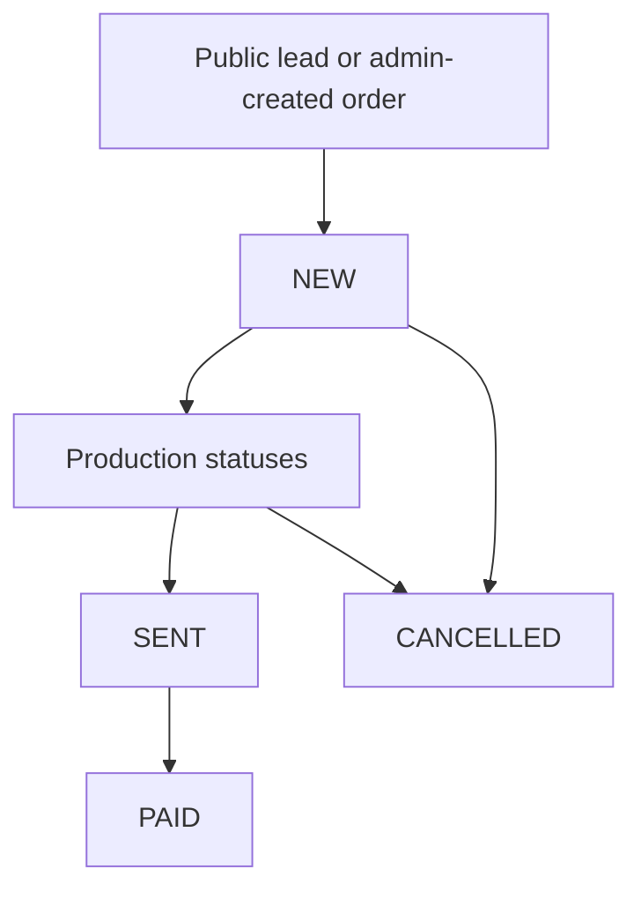

# System Map

Last updated: 2026-07-11

This document is the living map of the `racpechatca` CRM. Every meaningful
change to architecture, business rules, API contracts, deployment, or data
model should update this file in the same commit.

## Purpose

`racpechatca` is an internal CRM for photo printing and T-shirt orders. It
tracks leads, orders, executors, production statuses, stock, salary accruals,
payments, expenses, and P&L reports.

The production path is:

```text
local workspace -> GitHub origin -> production server -> Docker Compose
```

Current repository:

```text
https://github.com/Tigo929/racpechatca
```

Current production server:

```text
http://195.2.75.249/
```

## Runtime State

Production project path:

```text
/opt/raspechatka
```

Production services:

```text
postgres  -> PostgreSQL 16, database crm
backend   -> NestJS API on port 3000 inside Docker network
frontend  -> nginx serving React build on public port 80
```

Local workspace path:

```text
C:\Users\User\Desktop\racpechatca
```

Local note: Docker CLI was not available during the first audit, so full local
`docker compose up` was not verified on this machine. Local code build and test
checks passed.

## Top-Level Layout

```text
.
├── crm-new/                 # Backend: NestJS + Prisma
├── frontend/                # Frontend: React + Vite + nginx production image
├── docker-compose.yml       # Main production-like Compose file
├── docker-compose.prod.yml  # Prebuilt artifact Compose file
├── backup-db.sh             # Production database backup helper
├── AGENTS.md                # Codex working instructions
├── AUDIT_REPORT.md          # Previous audit notes
├── AUDIT_2026-07-09.md      # Latest finance/code/production audit
├── REPORT.md                # Previous report
└── SYSTEM_MAP.md            # This living system map
```

Generated or local-only files are intentionally not part of Git:

```text
node_modules/
dist/
.env
crm-new/src/generated/
*.tar
*.tar.gz
*.sql except Prisma migrations
```

## Backend Map

Backend stack:

```text
NestJS 11
Prisma 7
PostgreSQL
JWT auth
Docker
```

Entry points:

```text
crm-new/src/main.ts
crm-new/src/app.module.ts
crm-new/prisma/schema.prisma
crm-new/src/prisma/prisma.service.ts
crm-new/src/prisma/prisma.module.ts
crm-new/src/health.controller.ts
```

### Bootstrap

`main.ts` creates the Nest app, enables CORS, installs a global
`ValidationPipe`, enables DTO transformation and implicit query conversion,
then listens on `PORT` or `3000`.

Global validation behavior:

```text
whitelist: true
transform: true
enableImplicitConversion: true
```

Unknown request-body fields are stripped by validation.

Financial DTO safeguards:

```text
money fields are integer and >= 0
item quantities are integer and >= 1
order list limit is capped at 100
admin-created orders may start only as LEAD or NEW
```

### App Modules

```text
AuthModule
UsersModule
OrderPhotoModule
SalaryModule
ReportsModule
ExpensesModule
StockModule
```

`ConfigModule` is global. `ThrottlerModule` is configured for public lead spam
protection.

`PrismaModule` is global and owns the single application-level `PrismaService`
provider. Feature modules inject Prisma through this module instead of declaring
their own Prisma providers.

## Domain Model

Main Prisma models:

```text
User
OrderPhoto
ItemPhoto
ItemTshirt
TshirtStock
StockMovement
SalaryAccrual
SalaryPayment
PaymentAccrualLink
StatusHistory
OrderAssignment
UserRateHistory
ExpenseOrder
OzonWarehouse
OzonStockBulkOperation
OzonStockBulkOperationItem
```

Main enums:

```text
EnumRole: ADMIN, EXECUTOR
EnumProductCategory: PHOTO, TSHIRT
EnumStatus: LEAD, NEW, FOLDER_STRUCTURE_CREATED, IN_PROGRESS, PRINTED, READY,
            DONE, SENT, PAID, READY_FOR_REVIEW, COMPLETED, CANCELLED
EnumSourceOrder: AVITO, OZON, WB, LOCAL
EnumCommunication: AVITO, TELEGRAM, MAX, OZON
EnumDeliveryMethod: YANDEX_PVZ, OZON_PVZ, PICKUP, OZON_SELLER, WB_SELLER
EnumExpenseCategory: MATERIALS_PHOTO, MATERIALS_TSHIRT, DELIVERY_SUPPLIES,
                     EQUIPMENT, MARKETING, OTHER
```

## Business Flow

### Order Lifecycle


```mermaid
flowchart TD
  Lead["Public lead or admin-created order"]
  New["NEW"]
  Work["Production statuses"]
  Sent["SENT"]
  Paid["PAID"]
  Cancel["CANCELLED"]

  Lead --> New
  New --> Work
  Work --> Sent
  Sent --> Paid
  New --> Cancel
  Work --> Cancel
```

Photo status flow:

```text
LEAD -> NEW -> FOLDER_STRUCTURE_CREATED -> IN_PROGRESS -> READY -> SENT -> PAID
```

T-shirt status flow:

```text
LEAD -> NEW -> FOLDER_STRUCTURE_CREATED -> PRINTED -> READY -> DONE -> SENT -> PAID
```

### Financial Rules

The server is the source of truth for all financial fields.

```text
pricePosition = price * quantity + designCost
```

For free-price photo positions:

```text
pricePosition = price
```

Free-price positions can be mixed with normal positions. They store a human
name in `ItemPhoto.formatPaper`, keep `quantity` for composition clarity, and
do not multiply quantity by price. This is used for arbitrary photo add-ons and
for arbitrary/free-price positions inside T-shirt orders.

Order total:

```text
totalOrder = sum(photo pricePosition) + sum(tshirt pricePosition) + deliveryCost
```

If `customTotal` is supplied during order creation, it becomes the initial
order total. Later item or delivery mutations recalculate from saved positions.

Financial editing is blocked after salary is paid or partially paid.

### Assignment Rules

Admins can assign an active executor while creating a new order or later from
the order detail modal. Creating an order with `executorId` validates that the
user is an active `EXECUTOR`, stores `OrderPhoto.executorId`, records an
`OrderAssignment`, and sends the same Telegram assignment notification used by
manual assignment.

### Deadline Rules

Photo orders receive a production deadline and can be marked urgent in CRM.
T-shirt orders do not show or use the production deadline control. Generated
customer confirmation text does not include production deadlines.

### Salary Rules

Salary is based on net order value without delivery:

```text
salaryBase = totalOrder - deliveryCost
salaryAmount = round(salaryBase * rateBasisPoints / 10000)
```

Salary accrual is created when an admin moves an assigned order to `SENT`.

Salary payments:

```text
manual payment       -> closes pending accruals FIFO
payment by accruals  -> closes selected accruals and moves orders to PAID
status PAID          -> auto-pays remaining accrual for the order
```

### Stock Rules

T-shirt stock is tracked by:

```text
size + color
```

When an order moves to `SENT`, stock is consumed for non-client T-shirt items.
When an order leaves `SENT` or is deleted, stock is returned from
`StockMovement` records.

Stock consumption is idempotent: if movements already exist for an order, the
same order is not consumed twice.

If an order moves away from `SENT`, stock is returned and an unpaid salary
accrual for that order is removed. If salary was already paid, the rollback is
blocked to protect financial history.

### Review Reminder Rules

CRM automatically detects photo and T-shirt orders that are ready for a review
request.

Eligibility:

```text
productCategory = PHOTO or TSHIRT
status = SENT or PAID
clientReviewLeft = false
sentAt <= now - 84 hours
reviewReminderNotifiedAt is null
```

The backend scans at startup and then roughly once per hour. For each eligible
order it sends one Telegram notification to the working group with:

```text
order number
communication platform
link to the customer dialog
ready-to-copy review request text
```

The customer text is category-specific:

```text
PHOTO  -> 20 Polaroid-style photos + free next-order delivery
TSHIRT -> any mockup/design + free next-order delivery
```

After a successful group notification, `reviewReminderNotifiedAt` is set so the
same order is not reminded again. Direct automatic sending into Avito is not
implemented because the current system has no Avito messaging API credentials.

### Access Rules

Admins can manage:

```text
orders
users
salary
stock
reports
expenses
financial statuses
```

Executors can:

```text
view only assigned orders
move assigned orders in any workflow direction before PAID
not see financial fields in order responses
```

`PAID` is an admin-only financial status. `CANCELLED` is also admin-only because
it removes the order from the normal production flow.

For executors, `StripPricesInterceptor` removes:

```text
totalOrder
deliveryCost
price
pricePosition
designCost
```

## Backend API Map

Auth:

```text
POST /auth/login
GET  /auth/me
GET  /health
```

Orders:

```text
POST   /order-photo
POST   /order-photo/lead
GET    /order-photo
GET    /order-photo/stats
GET    /order-photo/executor-workload
GET    /order-photo/:idOrder
PATCH  /order-photo/:idOrder
PATCH  /order-photo/:idOrder/status
PATCH  /order-photo/:idOrder/assign
PATCH  /order-photo/:idOrder/review
DELETE /order-photo/:idOrder

POST   /order-photo/:idOrder/items
PATCH  /order-photo/items/:idItem
DELETE /order-photo/items/:idItem
GET    /order-photo/items/:idItem

POST   /order-photo/:idOrder/tshirt-items
PATCH  /order-photo/tshirt-items/:idItem
DELETE /order-photo/tshirt-items/:idItem
GET    /order-photo/tshirt-items/:idItem
```

Users:

```text
GET    /users
POST   /users
PATCH  /users/:id
DELETE /users/:id
```

Salary:

```text
GET  /salary/summary
GET  /salary/accruals/:executorId
GET  /salary/payments/:executorId
POST /salary/payments
POST /salary/payments/by-accruals
```

Reports:

```text
GET /reports/monthly
GET /reports/weekly
GET /reports/years
GET /reports/funnel
```

Expenses:

```text
POST   /expenses
GET    /expenses
DELETE /expenses/:id
```

Stock:

```text
GET   /stock
PATCH /stock
```

Print approval (ADMIN + ORDER_MANAGER; шаблоны правит только ADMIN):

```text
GET    /approvals?orderId=...
POST   /approvals
GET    /approvals/:id
PATCH  /approvals/:id
DELETE /approvals/:id
POST   /approvals/:id/print/:side
GET    /approvals/:id/print/:side
DELETE /approvals/:id/print/:side
POST   /approvals/:id/preview
POST   /approvals/:id/finalize
GET    /approvals/:id/file

GET    /mockup-templates
GET    /mockup-templates/:id/image
POST   /mockup-templates
PATCH  /mockup-templates/:id
POST   /mockup-templates/:id/image
DELETE /mockup-templates/:id
```

Ozon image card generator (ADMIN + MARKETPLACE_CLIENT; templates edited by ADMIN):

```text
GET    /marketplace/ozon/card-templates
POST   /marketplace/ozon/card-templates
GET    /marketplace/ozon/card-templates/:id/image
PATCH  /marketplace/ozon/card-templates/:id
POST   /marketplace/ozon/card-templates/:id/image
DELETE /marketplace/ozon/card-templates/:id

GET    /marketplace/ozon/card-batches/capabilities
GET    /marketplace/ozon/card-batches
POST   /marketplace/ozon/card-batches
GET    /marketplace/ozon/card-batches/:id
PATCH  /marketplace/ozon/card-batches/:id
DELETE /marketplace/ozon/card-batches/:id
POST   /marketplace/ozon/card-batches/:id/sources
POST   /marketplace/ozon/card-batches/:id/generate
GET    /marketplace/ozon/card-batches/:id/cards
GET    /marketplace/ozon/card-batches/cards/:cardId/preview
PATCH  /marketplace/ozon/card-batches/cards/:cardId
POST   /marketplace/ozon/card-batches/cards/:cardId/regenerate
GET    /marketplace/ozon/card-batches/cards/:cardId/template
POST   /marketplace/ozon/card-batches/:id/finalize
GET    /marketplace/ozon/card-batches/:id/download
POST   /marketplace/ozon/card-batches/:id/cards/bulk
POST   /marketplace/ozon/card-batches/sources/:sourceId/retry
GET    /marketplace/ozon/card-batches/sources/:sourceId/raster
DELETE /marketplace/ozon/card-batches/sources/:sourceId
```

Ozon warehouses and bulk stock updates (ADMIN + MARKETPLACE_CLIENT):

```text
GET    /marketplace/ozon/:accountId/warehouses
POST   /marketplace/ozon/:accountId/warehouses/sync

POST   /marketplace/ozon/:accountId/stocks/bulk/preview
POST   /marketplace/ozon/:accountId/stocks/bulk
GET    /marketplace/ozon/:accountId/stocks/bulk/:operationId
POST   /marketplace/ozon/:accountId/stocks/bulk/:operationId/retry-errors
GET    /marketplace/ozon/:accountId/stocks/history
```

## Frontend Map

Frontend stack:

```text
React 19
Vite
React Router
TanStack Query
Axios
Tailwind CSS
lucide-react
```

Entry points:

```text
frontend/src/main.tsx
frontend/src/App.tsx
frontend/src/api/client.ts
frontend/src/types/index.ts
```

Routes:

```text
/crm/login   -> LoginPage
/crm         -> OrdersPage
/crm/users   -> UsersPage, admin only
/crm/salary  -> SalaryPage, admin only
/crm/stock   -> StockPage, admin only
/crm/reports -> ReportsPage, admin only
*            -> /crm
```

API client:

```text
frontend/src/api/client.ts
```

The frontend uses relative API URLs. In production, nginx proxies API paths to
the backend service.

Frontend API modules:

```text
auth.ts
orders.ts
users.ts
salary.ts
reports.ts
expenses.ts
stock.ts
```

Important UI areas:

```text
pages/OrdersPage.tsx                 # Main CRM order table and filters
components/orders/OrderDetail.tsx    # Detail modal, status, assignment, client texts
components/orders/CreateOrderForm.tsx
components/orders/OrderEditForm.tsx
components/orders/StatusStepper.tsx
components/orders/ItemsTable.tsx
components/orders/TshirtItemsTable.tsx
```

The Orders page uses `/order-photo/stats` for top-level control cards. These
cards are calculated on the server across the whole current context, not just
the visible pagination page:

```text
active orders
new orders
orders in work
ready orders
urgent/overdue alerts
sent but unpaid orders
orders waiting for client review
review requests that are due now
```

## Infrastructure Map

### Docker Compose

`docker-compose.yml` defines:

```text
postgres
backend
frontend
```

Backend startup command:

```text
npx prisma migrate deploy && node dist/src/main
```

Compose health checks:

```text
postgres -> pg_isready
backend  -> GET http://localhost:3000/health
frontend -> GET http://127.0.0.1/
```

The backend `/health` endpoint also verifies PostgreSQL with a lightweight
`SELECT 1`.
Frontend healthcheck intentionally uses IPv4 `127.0.0.1`, because the nginx
container resolves `localhost` to IPv6 first while nginx listens on IPv4.

Frontend production runtime:

```text
nginx serving /usr/share/nginx/html
```

nginx proxies:

```text
/(health|order-photo|auth|users|salary|reports|expenses|stock) -> http://backend:3000
```

### Environment

Required production/local environment keys:

```text
DB_PASSWORD
JWT_SECRET
TELEGRAM_BOT_TOKEN
TELEGRAM_GROUP_CHAT_ID
```

Backend receives:

```text
DATABASE_URL
JWT_SECRET
JWT_EXPIRES_IN
PORT
TELEGRAM_BOT_TOKEN
TELEGRAM_GROUP_CHAT_ID
```

Never commit `.env` files or secrets.

Current pickup addresses used in generated customer messages:

```text
PHOTO  -> Измайловский проезд, 6, корп. 1, подъезд 3
TSHIRT -> ул. Верхняя Первомайская, 47, корп. 11, подъезд 2, 1 этаж, кабинет 116
```

### Backups

`backup-db.sh` dumps production PostgreSQL:

```text
/opt/raspechatka/backups/crm_YYYYMMDD_HHMMSS.sql.gz
```

It keeps the newest 14 backups.

Important: these are local server backups. A separate off-server backup target
is still recommended.

## Verified Checks

Verified on 2026-07-09:

```text
crm-new:  npm run build
crm-new:  npm run lint
crm-new:  npm test -- --runInBand
frontend: npm run build
frontend: npm run lint
```

Result:

```text
backend tests: 28 passed
backend lint: passed
frontend build: passed
frontend lint: passed
```

Verified production connectivity on 2026-07-09:

```text
HTTP port 80: reachable, 200 OK
SSH port 22: reachable
Docker: active
PostgreSQL: accepting connections
backend protected endpoint: 401 Unauthorized, expected without token
health endpoint: 200 OK, PostgreSQL checked
frontend container health: healthy
```

## Known Risks And Follow-Ups

1. Local Docker is not available on the current machine, so full local
   Compose-based runtime verification is pending.
2. `updateOrder` should be reviewed for transaction-level locking around
   total recalculation.
3. Frontend types should be kept fully synchronized with Prisma fields,
   especially `sentAt`, `gender`, and `printType`.
4. Production backups should eventually be copied off-server.
5. A repeatable deploy script should be added:

```text
backup -> git pull -> build -> migrate -> docker compose up -d -> health check
```

## Change Log

### 2026-07-08

- Added this living system map.
- Documented backend modules, domain model, business flows, frontend routes,
  infrastructure, verified checks, and follow-up risks.
- Added photo workflow status `IN_PROGRESS` / `В обработке`.
- Allowed assigned executors to move workflow statuses in any direction before
  `PAID`; `PAID` remains admin-only.
- Fixed salary consistency when executors move orders to `SENT`.
- Fixed rollback from `SENT`: unpaid accrual is removed and paid salary blocks
  rollback.
- Changed pickup cabinet in customer messages to 116.
- Added server-side order statistics for the CRM dashboard so operational and
  financial counters are not limited to the current pagination page.
- Added automatic review-request detection for sent photo orders after 84 hours;
  CRM notifies the working Telegram group once per eligible order with a
  ready-to-copy client message and dialog link.
- Extended review-request detection to sent T-shirt orders after 84 hours, with
  a category-specific gift offer: any mockup/design plus free next-order
  delivery.
- Extended review-request detection from only `SENT` orders to `SENT` or `PAID`
  orders, so orders that were paid after shipping are still eligible for a
  review request.

### 2026-07-09

- Added finance/code/production audit document `AUDIT_2026-07-09.md`.
- Added public `/health` endpoint that checks PostgreSQL.
- Added Docker Compose health checks for PostgreSQL, backend, and frontend.
- Fixed frontend Docker healthcheck to use IPv4 loopback inside nginx.
- Moved `PrismaService` ownership into a single global `PrismaModule`.
- Strengthened backend DTO validation for money, quantities, pagination, and
  initial order statuses.
- Synced production and prebuilt Compose files for health checks and Telegram
  runtime environment.
- Added per-position free-price editing for photo/free-form rows.
- Added executor assignment during order creation.
- Split generated pickup addresses by product category and removed T-shirt
  deadline display/control.

### 2026-07-11

- Removed production deadline text from copied order confirmations.
- Hardened copied item text so free-price/photo free-form positions never show
  paper type labels such as `Глянец` or `Матт`.

### 2026-08-24

- Added the print approval module (`crm-new/src/approval/`): mockup templates
  with print-area calibration, per-side print placement, server-side PNG sheet
  rendering, and versioned approvals attached to the order.
- New tables `MockupTemplate` and `PrintApproval`; new enums
  `EnumApprovalSide` and `EnumApprovalStatus`. Existing tables untouched.
- New nginx API prefixes `approvals` and `mockup-templates`.
- Backend image now installs `fontconfig` and `ttf-dejavu`: the approval sheet
  draws Cyrillic text through sharp/SVG, and alpine ships no fonts at all.
- New upload directories inside `UPLOAD_DIR`: `mockups/` and `approvals/`.

- Added the executor filter for the orders list: `executorId` in the orders
  query (a user id, or `none` for unassigned) plus
  `GET /order-photo/executor-workload` with per-executor active load. The role
  guard still wins — an EXECUTOR cannot read another executor's orders through
  the parameter (`crm-new/src/order-photo/executor-filter.spec.ts`).
- Fixed the Vite dev proxy: it listed only six API prefixes, so `/tasks`,
  `/reports`, `/expenses`, `/scenarios`, `/partner*`, `/canvas`, `/telegram`,
  `/approvals` and `/mockup-templates` fell through to the SPA in local dev and
  returned HTML instead of JSON. `nginx-routes.spec.ts` now checks the Vite
  proxy the same way it checks nginx.

### 2026-08-24 (later)

- Added the Ozon image card generator, stages 2-3 of its spec
  (`crm-new/src/marketplace/image-cards/`): card templates with a
  mouse-drawn placement area, batch upload of print artwork, PDF
  rasterization and background preparation of sources.
- New tables `ImageCardTemplate`, `ImageCardBatch`, `ImageCardSource`,
  `ImageCardGenerated`; new enums `EnumCardBatchStatus`,
  `EnumSourceAssetStatus`, `EnumGeneratedCardStatus`.
- Backend image now also installs `poppler-utils`: sharp cannot read PDF
  (`sharp.format.pdf.input` is false for file, buffer and stream), so PDF
  artwork is rendered by `pdftocairo`.
- New upload directories inside `UPLOAD_DIR`: `ozon-templates/` and
  `ozon-image-cards/<batch>/{source,generated}/`.

### Ozon Image Cards

Что важно знать про модуль:

- **Область размещения** задаётся в пикселях шаблона и своя у каждого
  шаблона: у чёрной и белой футболки композиция может не совпадать.
- **Положение принта** нормализовано относительно области: `x`, `y` — центр
  в долях, `scale` — доля от вписанного размера. Пиксели браузера не
  хранятся: карточка собирается и в превью, и в полном разрешении.
- **Версионность шаблонов** сделана снимком: карточка хранит файл, холст и
  область на момент генерации, а файлы шаблонов при замене не удаляются.
  Поэтому замена шаблона не меняет вид старых пачек.
- **Очередь обработки — таблица, а не Redis.** Образец — GulianOutbox.
  Строка занимается условным обновлением (`status: PENDING` → `PROCESSING`),
  зависшие после перезапуска возвращаются в очередь на старте.
- **Тип файла определяется по первым байтам**, а не по MIME и расширению:
  и то и другое присылает браузер.
- **Файлы грузятся по одному на запрос:** nginx пропускает 30 МБ на запрос
  целиком, и пачка из полусотни макетов в него не влезает.
- **Прозрачные поля обрезаются** при подготовке исходника: у макетов вокруг
  рисунка часто половина холста пустоты (замерено: 1400×1800 → 800×662,
  21% площади). Без обрезки принт «вписывается в область» вместе с
  пустотой и выходит вдвое меньше задуманного. Белую рамку не трогаем —
  удаление белого фона это отдельная настройка, по умолчанию выключенная.
- **Превью и финал считает один и тот же код**, отличается только длинная
  сторона: иначе на сетке было бы одно, а в скачанном файле другое.
- **Статус FINALIZED руками не ставится:** его назначает только финальный
  рендер, когда файл собран и прошёл проверку требований Ozon. Иначе
  появились бы «готовые» карточки без файлов.
- **Слой жестов общий** с редактором согласования:
  `frontend/src/components/shared/TransformStage.tsx` — перетаскивание,
  пропорциональный ресайз за угол, подгонка стрелками. Геометрия у
  модулей разная (сантиметры против доли области), поэтому наружу
  отдаются смещение и множитель, а не готовые значения.
- **Подложка редактора — шаблон из снимка карточки**, а не текущая
  версия шаблона: иначе после замены человек двигал бы принт по одной
  картинке, а получал другую.
- **Требования Ozon собраны в одном месте** — `ozon-image-preset.ts`:
  минимум 900 × 1200, соотношение 3:4 с допуском 2%, PNG, до 10 МБ.
  Площадка меняет правила без предупреждения, и править придётся ровно
  эту таблицу, а не редактор и не рендер.
- **Проверяется записанный файл, а не намерения:** размеры, формат и вес
  берутся из того, что реально лежит на диске. Не прошедшая проверку
  карточка получает статус ERROR и в архив не попадает.
- **Финализация не берёт «требует проверки»** без отдельного
  подтверждения: именно на этих карточках автоматика и засомневалась.
- **Архив собирается потоком** (`archiver`): сотня PNG по паре мегабайт
  не должна лежать в куче процесса целиком.
- **Шаблон выбирается на пачку.** Пустой список в настройках означает
  «брать активные по цвету»; первое же снятие превращает его в явный
  список. Так можно держать несколько вариантов шаблона и сравнивать
  их, не переключая «активен» туда-сюда.
- **Отчёт по пачке считает сервер**, а не клиент: собранные на клиенте
  цифры разъедутся с базой ровно тогда, когда по ним начнут принимать
  решения.
- **Шаблон и дизайн разбираются один раз и держатся в памяти сырыми
  пикселями.** Без этого один и тот же PNG декодировался на каждую
  карточку: композит с декодом шаблона — 429 мс, из готовых пикселей —
  188 мс; дизайн — 132 мс против 27 мс. Кэш дизайна сбрасывается при
  повторной обработке исходника (`forgetDesign`), иначе после
  «Повторить» взялась бы картинка от прошлого раза.
- **Скорость сборки упирается в размер шаблона.** Замерено на 42
  дизайнах: 1200x1600 — 18 с, 4000x5333 — 25 с (до всех правок было
  35 и 282 секунды соответственно). Готовая карточка ограничена 2000 по длинной стороне
  (FINAL_LONG_SIDE): без потолка карточка с шаблона 4000 px весит
  17,5 МБ при лимите Ozon в 10 МБ, то есть площадка её не примет,
  а сборка занимает втрое дольше.
- **Финал собирается по одному признаку: карточка одобрена, файла нет.**
  Условия по состоянию пачки здесь нет намеренно — раньше стояло
  `batch: { status: 'FINALIZING' }`, и одобренная кнопкой в сетке
  карточка не подхватывалась никем: пачка при этом в «проверке», а не
  в «финализации». Панель вечно показывала «Собирается», хотя не
  собиралось ничего.
- **Сетка опрашивает сервер, пока в пачке есть незавершённая карточка.**
  Условие смотрело только на отсутствие превью — и это была ошибка, из-за
  которой сборка выглядела бесконечной: к моменту нажатия «Сгенерировать
  финальные PNG» превью есть у всех, опрос выключался совсем, и экран
  застывал на «Собирается», хотя файл собирался за десятые доли секунды.
- **Пауза между карточками пропорциональна работе (BREATHE_SHARE),**
  а не фиксирована. Фиксированные 60 мс были разумны, пока рендер
  занимал сотни миллисекунд; после оптимизаций он занимает в среднем
  64 мс, и замер показал, что паузы стали половиной времени пачки —
  10,1 с пауз против 10,8 с полезной работы на 42 дизайнах. Доля
  держит соотношение постоянным при любой скорости рендера.
- **Прежняя формулировка про паузу (BREATHE_MS).** У сервера
  одно ядро, и отрисовка занимает его целиком: замерено на проде во
  время генерации — /health не отвечал две минуты подряд, при том что
  бэкенд не падал (аптайм рос непрерывно), а сразу после отвечал за
  176 мс. То есть вставала вся CRM, а не только генератор. Пауза в
  60 мс оставляет около десятой части процессора остальным запросам.
- **Готовая карточка отдаётся в JPEG q92**, а не PNG. Кодирование
  карточки 1500x2000: PNG — 148 мс и 3,64 МБ, JPEG — 22 мс и 0,21 МБ.
  Кодирование было основной оставшейся тратой. Замер в один поток (как
  на сервере с одним ядром) на 42 дизайнах: PNG — 27 с и 392 МБ всех
  финалов, JPEG — 14 с и 24 МБ. Ozon принимает JPG наравне с PNG.
- **PNG жмётся уровнем 6, а не 9.** Формат сжимает без потерь на любом
  уровне: замерено 2283 мс и 17,5 МБ против 914 мс и 17,9 МБ — два
  процента веса за двух-с-половиной-кратную скорость.
- **Белый фон чистится один раз на исходник** и кладётся рядом с
  растром: тот же дизайн идёт в две карточки, у каждой превью и финал.
- **PDF проверен вживую** на Poppler 25.07: страница 800×1000 pt даёт
  растр 1920×2400 с прозрачным фоном за ~400 мс. Тест `pdf-raster.spec.ts`
  пропускает себя там, где Poppler не установлен.

### Print Approval

Что важно знать про модуль:

- **Калибровка** — пара «зона печати в пикселях фотографии» и «её реальный
  размер в миллиметрах» (`MockupTemplate`). Из неё выводится масштаб, и только
  благодаря ей «28 × 35 см» — это размер на картинке, а не подпись.
- **Размещение принта** хранится нормализованным (`PrintApproval.sides`): центр
  принта в долях зоны печати плюс физический размер в миллиметрах. Масштаба как
  отдельного числа нет — размер и есть масштаб.
- **Геометрия продублирована** в `crm-new/src/approval/approval-geometry.ts` и
  `frontend/src/utils/approval-geometry.ts`. Сервер рисует итоговый файл, а
  редактор обязан показывать то же самое до нажатия «Готово». Правится одна
  формула — правятся обе.
- **Версии не перезаписываются.** Повторное «Готово» переписывает лист своей
  версии; новая версия создаётся отдельной записью (`orderId + version`).
- Статусы версии не дублируют `EnumStatus`: `APPROVAL_SENT` говорит про заказ,
  `EnumApprovalStatus` — про конкретный макет.

### 2026-08-25

- Added bulk stock updates for Ozon across several warehouses
  (`crm-new/src/marketplace/ozon/ozon-bulk-stock*`, `ozon-stock.service.ts`,
  `ozon-warehouse*`). Entry point is the product list in «Мои товары»:
  select products, pick warehouses, review the summary, confirm.
- New tables `OzonWarehouse`, `OzonStockBulkOperation`,
  `OzonStockBulkOperationItem`; new enums `EnumBulkStockMode`,
  `EnumBulkStockStatus`, `EnumBulkStockItemStatus`.
- Warehouses are now stored locally instead of being fetched on every modal
  open. The previous route called `checkConnection`, which also pulled the
  product list — two Ozon requests for a directory that changes once in months.
- New background worker `OzonBulkStockProcessorService`: a table queue with
  an interval tick, same pattern as image cards and GulianOutbox. No Redis.
- No new nginx prefixes: everything lives under the existing `marketplace` one.

### Ozon Bulk Stock

Что важно знать про модуль:

- **Ozon разрешает трогать одну пару «товар × склад» не чаще раза в тридцать
  секунд.** Это самое жёсткое ограничение задачи, и именно оно, а не объём,
  делает отправку фоновой: у каждой пары есть `lastSentAt`, и обработчик
  берёт только те, чьё окно истекло. Без этого кнопка «повторить только
  ошибки» гарантированно получала бы отказ второй раз подряд.
- **За один запрос — сто пар**, причём считаются именно пары: один товар
  на трёх складах это три позиции, а не одна.
- **В одном запросе — один склад.** Ozon отвечает по `offer_id` и склад
  не называет; смешанная пачка сделала бы отказ неоднозначным у товара
  с двумя складами, и в историю попала бы неправда о том, где остаток
  изменился. Плата — лишний запрос-другой.
- **Молчание не считается успехом.** Товар, о котором площадка ничего
  не сказала, уходит в ошибки со статусом `NO_RESULT`.
- **Режим «Добавить» считается перед самой отправкой**, а не при
  подтверждении: между ними проходят секунды, за которые товар могут
  купить. Атомарного increment у Ozon нет вовсе. Пара без известного
  текущего остатка уходит в ошибку — прибавить к неизвестному можно
  только выдумав ноль, а это обнуление склада.
- **Текущие остатки по складам** читаются методом
  `/v1/product/info/stocks-by-warehouse/fbs`, и он опознаёт товар числовым
  sku, а не артикулом. Каталог сопоставляет одно с другим по выбранным
  товарам. Остатки в списке «Мои товары» — это сумма по всем складам,
  и для этой задачи она непригодна.
- **Деловая ошибка не повторяется автоматически** (товар не найден, склад
  недоступен), временная — до трёх попыток. Решение о повторе деловых
  ошибок принимает человек кнопкой.
- **Порог усиленного подтверждения — 500 пар**, это наше число, а не лимит
  площадки: оно про цену ошибки. Обнуление предупреждается отдельно при
  любом размере операции.
- **Склады не удаляются, а помечаются `archivedAt`**: на них ссылается
  история операций, и удалённый в кабинете склад нужно уметь назвать
  по имени через полгода.
- **Доступность склада считается чёрным списком статусов, а не белым.**
  Незнакомый статус считаем рабочим: Ozon добавляет статусы молча, и белый
  список означал бы, что однажды утром остатки не проставить нигде.

## Update Rule

Whenever a future change affects any of these areas, update this file in the
same commit:

```text
architecture
data model
API route or contract
status flow
financial rule
salary rule
stock rule
role/access rule
frontend route or major page behavior
deployment/runtime behavior
environment variables
backup/deploy process
known risks
```
